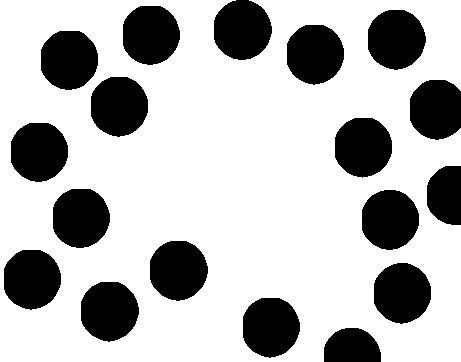
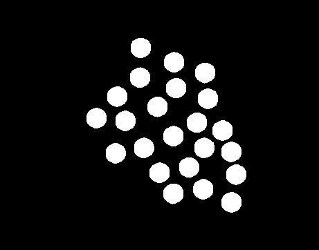
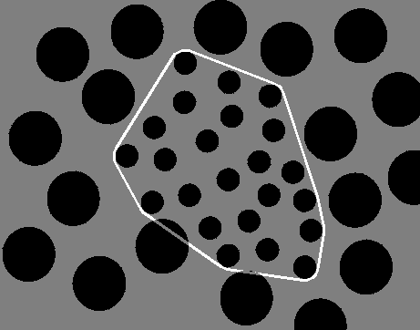

# 第五次小作业

## 结果

### 大球图像



### 小球图像



### 分界



## 方法

### 分离

图像为二值图，且大小球都为圆形，唯一的区别是半径。因此考虑使用开闭运算。
\
用半径$r$满足$r_{small} < r < r_{big}$的圆形为结构元，进行一次闭运算，即可得到大球部分。用原图和大球相减可以得到小球部分。

### 边界

直接使用小球所构成图像的最小凸包的边界作为分离边界。

使用课上讲的方法，依次用四个“【”型结构元对小球图像进行迭代运算，即得到凸包区域。对区域和其腐蚀进行相减得到边界。

实际实现中，调用了opencv库中的凸包算法ConvexHull。

## 程序运行方法

```ps2
pip3 install python-opencv
python3 HW5.py
```
