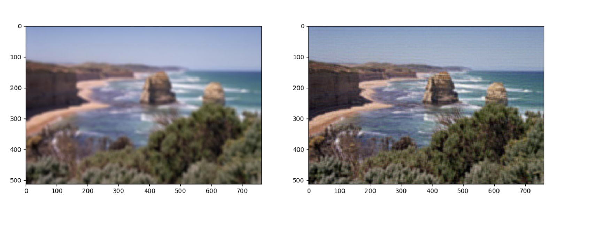

# 第三次小作业

## 方法

观察原图，发现模糊形状近似于正方形

因此猜测原图是使用了均值滤波器滤波

因此估计PSF为均值滤波卷积核，采用维纳滤波公式，在频域进行解卷积

$$
\hat F(u, v) = \frac{\bar H(u, v) G(u, v)}{ H^2(u, v) + k}
$$

经过多次实验，发现均值滤波核为11*11时，滤波效果最佳。

此外，实验发现，由于均值滤波器不够平滑，滤波结果的边缘部分有较强的振铃现象。为解决这一问题，将图像边缘处进行镜像padding，经过变换后再裁剪出原图像部分，得到了较好的效果，但图中仍可看到轻微的振铃。

## 结果

如图，变换结果比原图清晰，但图像中仍有振铃

## 代码运行

    python HW3.py
