# 第二次小作业

## 任务一：去网格

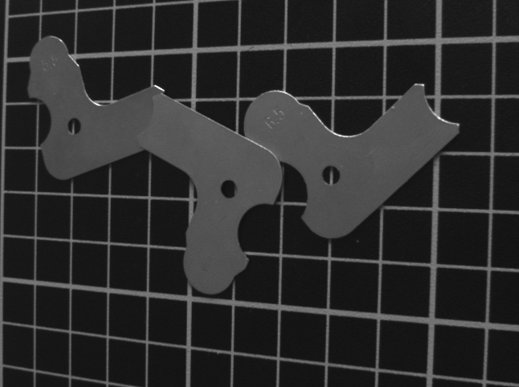

如上图所示的图片中，前景是工件，背景为横竖交叉的网格。任务一就是要 将前景的工件和背景的网格分开。尽量在不损伤工件的情况下，去除掉所有的网 格。请同学们根据课上所讲的知识，选择适当的方法，完成这一任务。

### 思路

观察发现，网格和工件相对背景亮度都较高。因此可以首先进行二值化。

其次，网格是比较细的线，工件区域则成片连接。因此对二值图可以进行开运算，即先腐蚀再膨胀，这样可以去掉大部分细线。

除此之外，由于网格基本都是水平竖直方向，因此可以考虑进行方向滤波，即在频域去掉某些方向的频谱。

### 实际工作流程

首先将原图转为灰度图，再进行二值化。使用的阈值是经过观察得出的（50）.

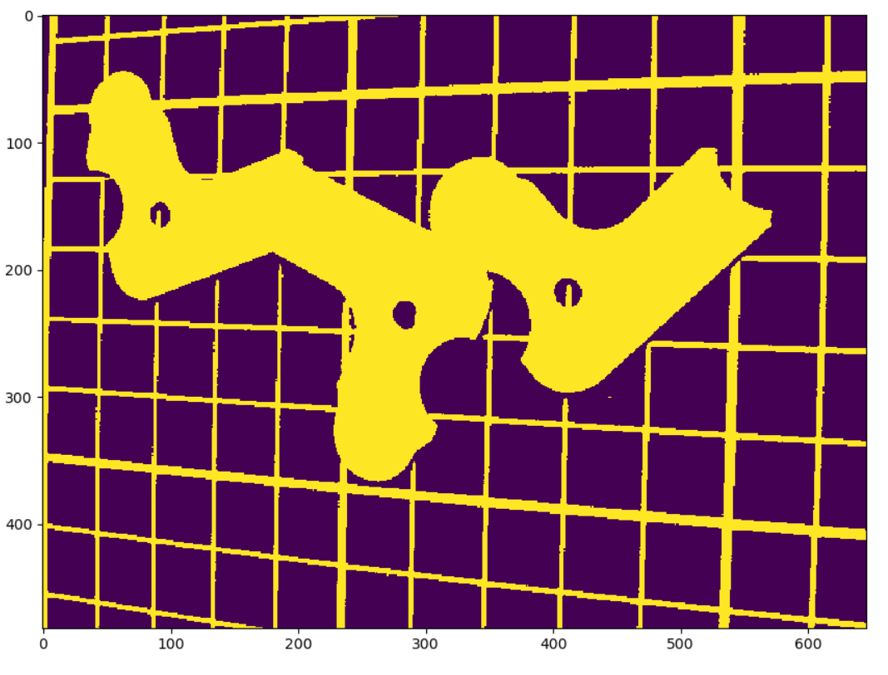

对其进行开运算

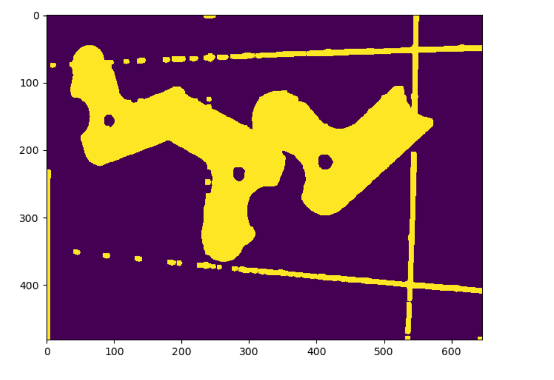

可以看到大部分网格都去掉了。还有一些小点。这些小点和工件都是分离的，因此使用连通域算法先求所有连通域，然后找出面积最大的连通域。

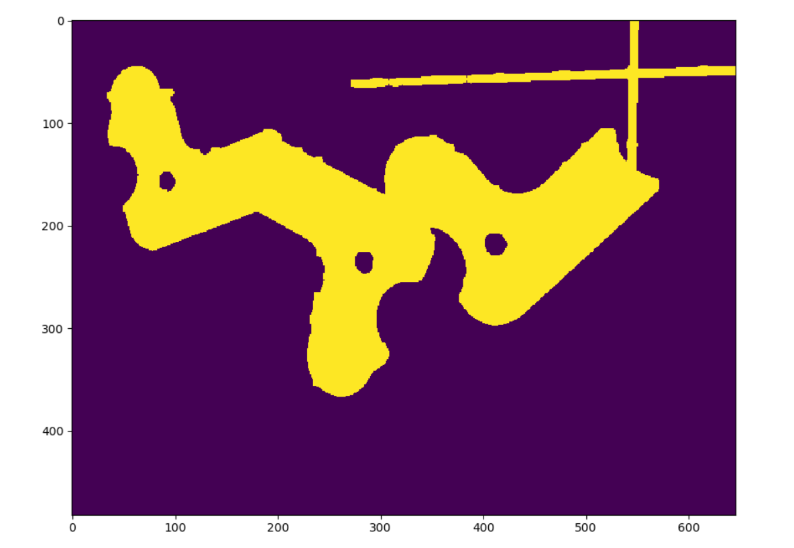

现在还剩右上角的十字架没有去掉。由于工件大部分边缘都不是水平竖直的，因此直接用方向滤波应该就能滤掉这个十字架。

对上图进行二维DFT（为了显示清楚，取了对数）

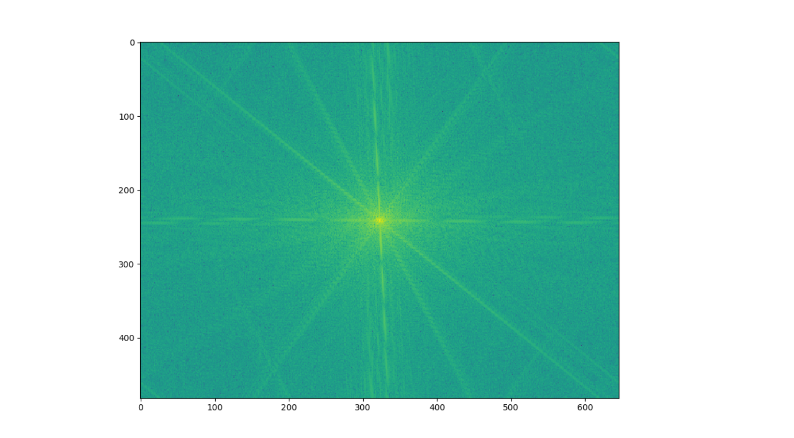

可以明显看到一横一竖两条边对应的频谱。

构造一个十字形状的滤波器，保留低频成分的同时滤去对应方向高频成分

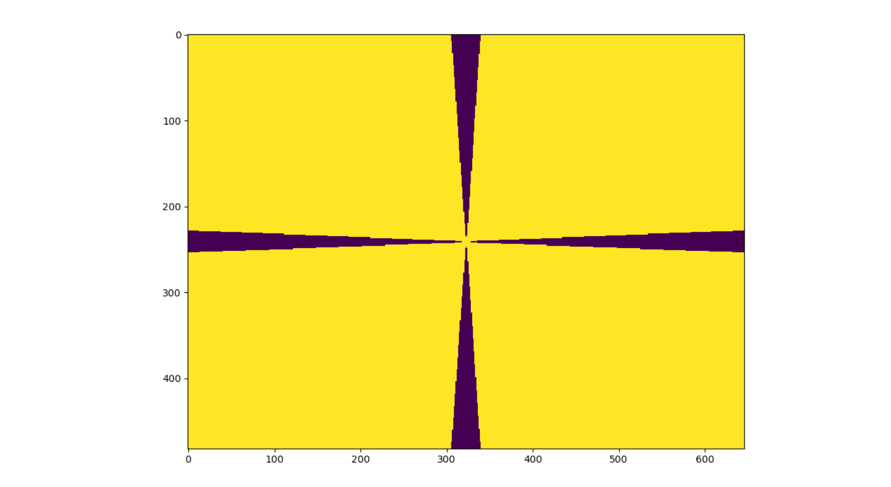

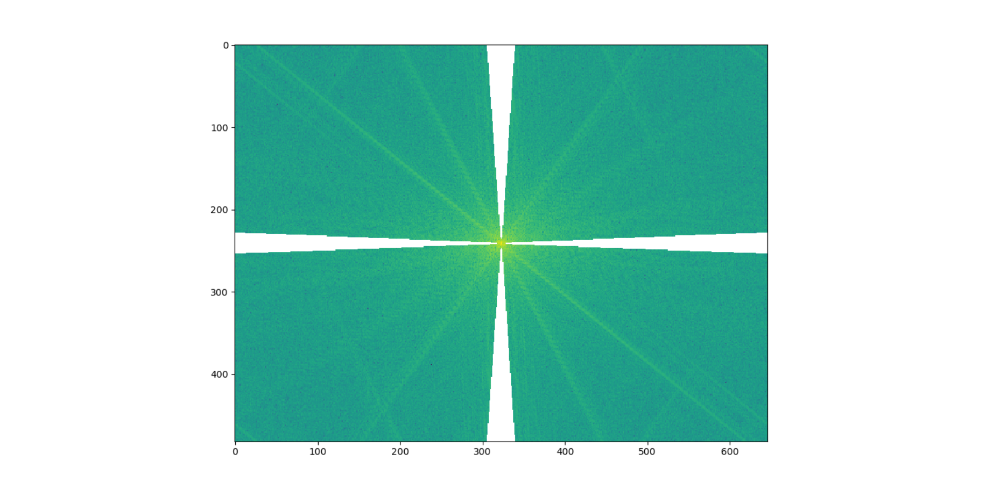

将其变换回空域，得到

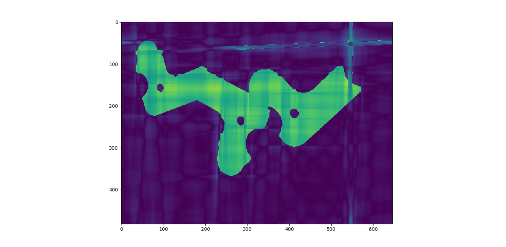

重新选定合适阈值进行二值化

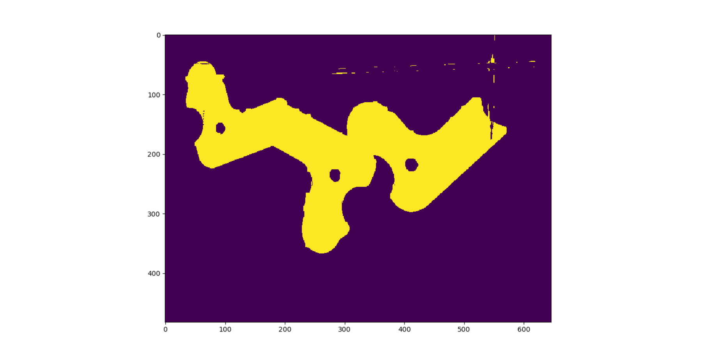

发现十字基本去除干净，还有一些分离的残余点，经过开运算即可去除

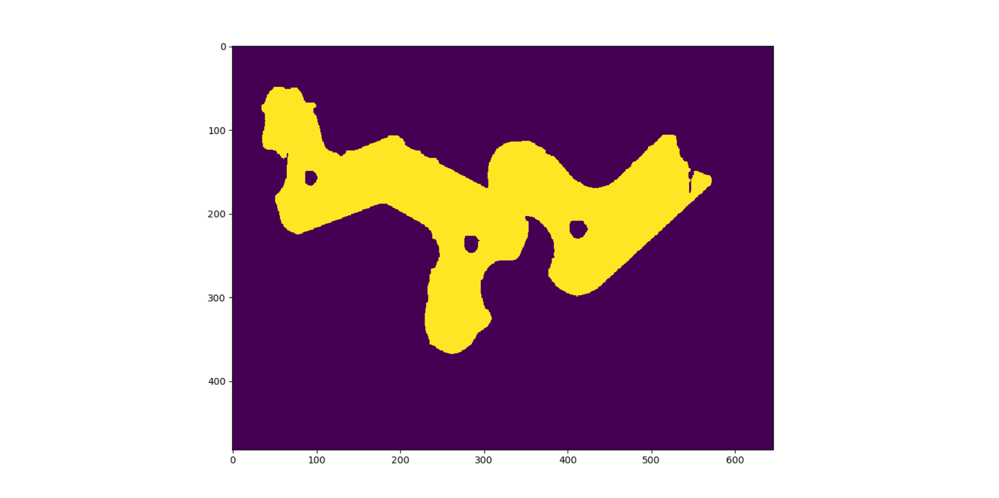

不过工件也有一些损伤，这时候用闭运算修补一下

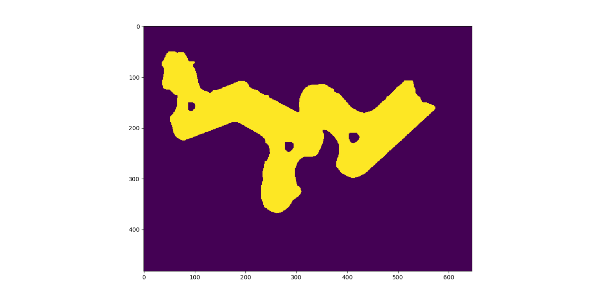

这次闭运算和开运算相比最开始进行的开运算，卷积核半径都要小一些。完成闭运算后，工件基本被完整提取出来了。

此时用此二值图和原图相乘，就能提取出工件了

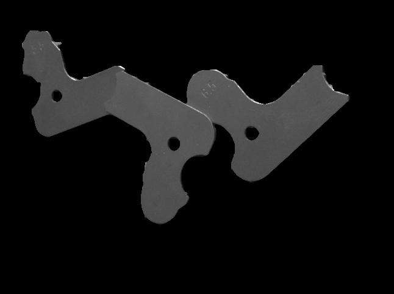

## 任务二：提取边缘

在任务一的基础上，根据任务一中提取到的工件，利用课上讲过的有关知识，提取工件的边缘信息。应当尽量保证边缘的连续和完整。这个边缘包括所有工件的内、外边缘（换句话说，这三个工件内部有个圆圈，这个边缘也是需要提取的；这三个工件之间存在重叠的区域，重叠区域的边缘也应当尽量显示出来）。

### 处理过程

openCV库中提供了一种强大的边缘检测算法：Canny算法。下面简述该算法流程

1. 消除噪声，一般使用高斯平滑滤波器滤波
2. 用一阶偏导的有限差分来计算梯度的幅值和方向
3. 对梯度幅值进行非极大值抑制

这一步的意义是: 图像梯度幅值矩阵中的元素值越大，说明图像中该点的梯度值越大，但这不不能说明该点就是边缘。如果一个梯度值非0，但也不是极大值，说明该点很可能不在边缘上，旁边极大值点比它更接近边缘。因此，将非极大值点所对应的灰度值置为0，可以剔除掉一大部分非边缘的点。

4. 用双阈值算法检测和连接边缘

以往的算法是选择单阈值，如果选择高阈值，根据高阈值得到一个边缘图像，则会删除实际上有效的边缘点，这样一个图像含有很少的假边缘，但是由于阈值较高，产生的图像边缘可能不闭合。如果采用单一的低阈值，则会存在一些伪边缘。如果采用双阈值，将高阈值点周围（一般找8连通点）的低阈值点加入边缘中，就可以减少边缘的中断，提取出更连续的边缘。Canny的建议是高阈值和低阈值的比率应为2：1，3:1 

采用该算法，得到的边缘如图

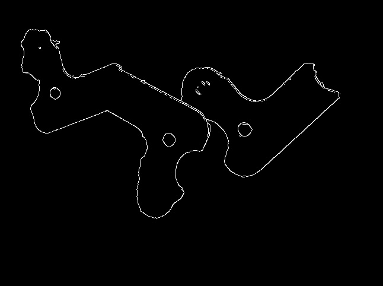

总体来看，大部分外边缘和内边缘都成功找到。有一处工件重叠，两个工件相邻像素值太过接近，因此边缘没能检测到。此外，工件上的一些凹陷的文字也被当做边缘检测了出来。

## 代码运行方法

运行

    python HW2.py

即可

python环境需要预装opencv库。建议使用4.1.1版。
