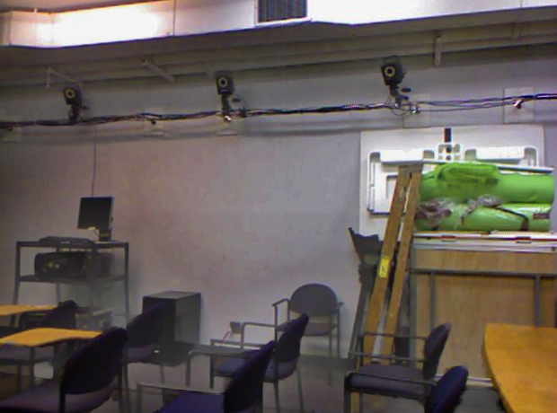

# 图像去雾大作业

自81 2018011444 魏欣然

## 算法

本次大作业中我实现并对比了两种算法，分别是暗通道方法和直方图均衡方法。其中直方图方法为限制对比度自适应直方图均衡(Contrast Limited Adaptive Histogram Equalization, CLAHE)。

### 雾图模型

假设无雾条件下图像为$J(x)$，大气在像素点x处的透射率为$t(x)$，全局的大气光强度为$A$，有雾图像为$I(x)$，则可以假设这样的模型：

$$
I(x) = J(x)t(x)+A(1-t(x))
$$

去雾问题即：在仅知道$I(x)$的情况下，通过某些方法估计$A$和$t(x)$，从而求解出$J(x)$

### 暗通道方法

该方法由何凯明等于2015年提出。其核心是引入了暗通道先验，从而可以快速求解出J(x)

具体来说，何等人发现，对于无雾图像的大部分像素点，其R G B三通道一般总有一个通道像素值很小。因此，他们提出，一幅图像的暗通道为

$$
J^{dark}(x) = \min_{y \in \Omega(x) } { \min_{c \in \{ r,g,b\}} {J^c(y)} }
$$

即：该像素邻域内RGB通道最小值的最小值，就是像素点的暗通道值。根据大量实验结果，对于无雾自然图像，该值趋于0. 即

$$
J^{dark}(x) \to 0
$$

这就是暗通道先验，它是根据统计数据得出的额外的先验信息。

将有雾图像模型两侧分别取两次最小值，并将A除到分母中.此处各通道的全局光强度可以不同。

$$
\min_{y \in \Omega(x) } { \min_{c \in \{ r,g,b\}} {\frac{I(y)}{A^c}}} = t(x) \min_{y \in \Omega(x) } { \min_{c \in \{ r,g,b\}} {\frac{J(y)}{A^c}}} + (1-t(x))
$$

根据暗通道先验，真实图像暗通道应该趋于0，即

$$
\min_{y \in \Omega(x) } { \min_{c \in \{ r,g,b\}} {\frac{J(y)}{A^c}}} = 0
$$

带入上式中，可得

$$
t(x) = 1 - \min_{y \in \Omega(x) } { \min_{c \in \{ r,g,b\}} {\frac{I(y)}{A^c}}}
$$

为了保留一些空气颗粒的存在，需要保留一些雾，因此将t(x)修正为下述公式

$$
t(x) = 1 - \omega \min_{y \in \Omega(x) } { \min_{c \in \{ r,g,b\}} {\frac{I(y)}{A^c}}}
$$

其中参数$\omega$取经验值0.95

现在还需求出全局光A。由于有雾图像一般含有天空，因此可以认为最亮的一部分像素就对应天空，也就对应了全局光强度。因此取全图最亮的一部分像素值之平均作为A的值。

此时，即可还原出J(x):

$$
J^c(x) = \frac{I^c(x) - A^c}{\max (t(x), t_0)}+A^c
$$

这里$t_0$是一个较小的值，一般取0.1，其目的是防止t(x)较小时求出的J(x)过大。

### CLAHE方法

CLAHE源自于直方图均衡(HE，Histogram Equalization)方法。

HE的核心思想是，改变像素灰度值，将灰度值的累积分布图Normalize到一条直线上，让直方图尽量平均。然而，HE容易导致的问题是：如果直方图十分偏向某一侧，HE后会使其整体向另一侧移动，无法充分利用整个灰度动态范围。

AHE(自适应直方图均衡化)是对上述方法的改进，其思想是将全图分块，逐块进行直方图均衡。这样得到的图像对比度高。然而，AHE的问题是：某些暗色子块的灰度可能会被整体移到亮色部分，使图像严重失真。因此，需要对局部对比度进行限制，这就是CLAHE(Contrast Limited Adaptive Histogram Equalization, CLAHE)，限制对比度的自适应直方图均衡化。

具体来说，对于每一个子块，CLAHE设定两个阈值u和l。直方图高于阈值u的部分限制为阈值u，低于阈值l的部分限制为阈值l，其余部分抬高一定的像素点数目。

对于每个子块做上述直方图变换后，还需要考虑子块间衔接问题。CLAHE对子块衔接处使用双线性插值来避免不连续性。

## 效果对比

| 原图 | 暗通道 | CLAHE |
|  ----  | ----  | ----  |
|  |  |  |
|  |  |  |
|  |  |  |
|  |  |  |
|  |  |  |
|  |  |  |

经过对比发现：整体看来暗通道方法优于CLAHE方法。对于医学图像而言，暗通道法基本去掉了所有雾，余下组织清晰。CLAHE则背景雾较大，图片饱和度不高。对于室内图像，CLAHE优于暗通道。暗通道法在处理室内墙壁时产生了许多伪影，但CLAHE没有这个问题。对于室外图像，暗通道法的去雾效果更好。但图6的暗通道结果中，天空部分产生了较大的色差，且在近景中景边缘产生了伪光。CLAHE方法虽然没有把雾都去掉，但近景比较清晰。

对于不同的情景特点，应该选择不同的去雾算法，或以某种形式结合多种算法的特点，来获得更好的效果。

## 代码运行

1. 在python环境中安装opencv库。建议python版本为3.7.1 opencv版本>=4.1.1
2. 进入项目根目录，执行命令

    python Project1.py
