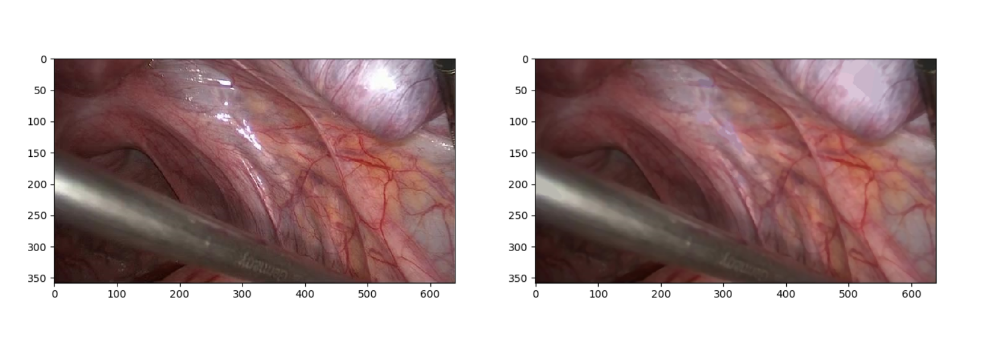
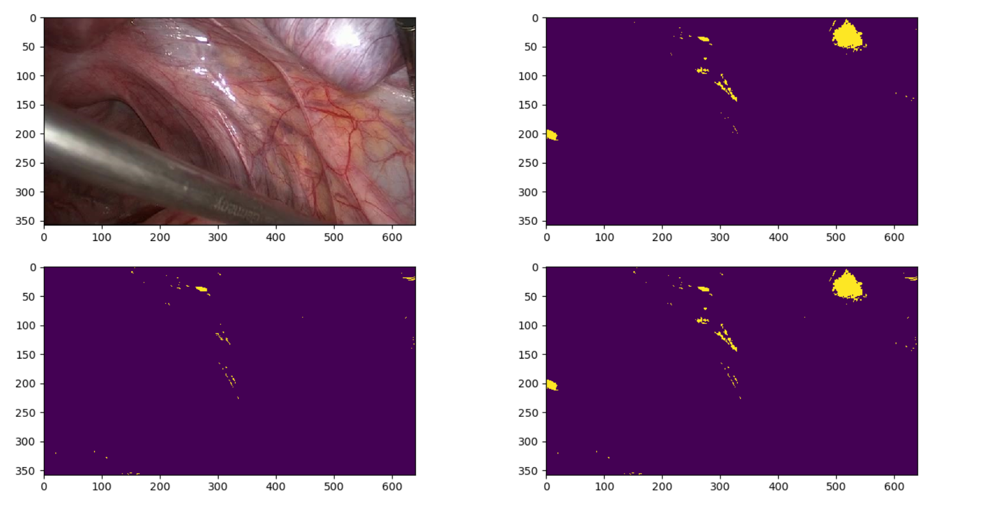
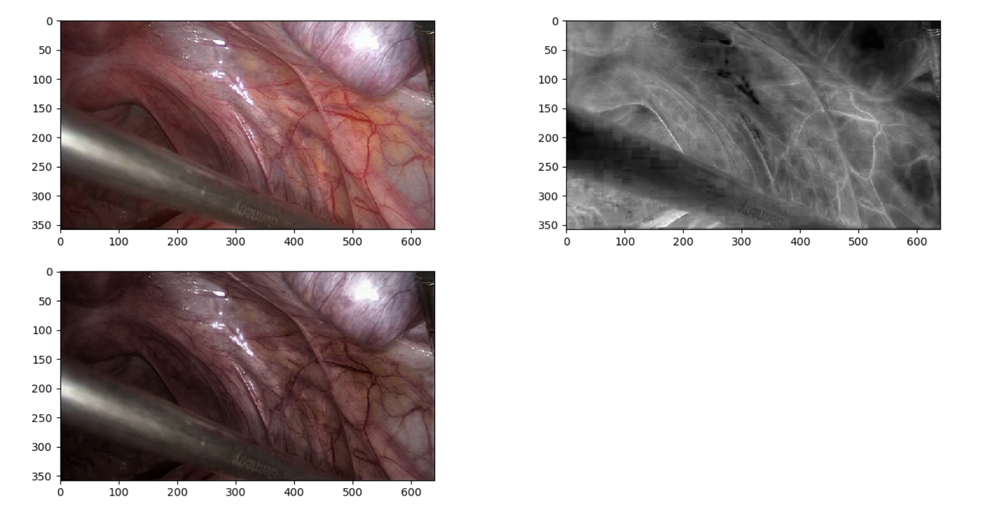
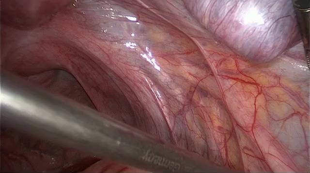
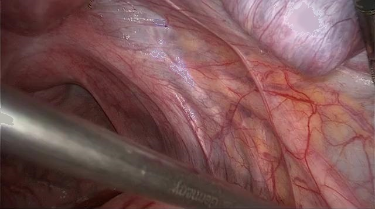

# 去反光算法

本次大作业我调研了两种去反光算法，分别来自两篇文章：

[文献1]

Arnold M, Ghosh A, Ameling S, et al. Automatic segmentation and inpainting of specular highlights for endoscopic imaging[J]. Journal on Image and Video Processing, 2010, 2010: 9.

[文献2]

Meslouhi O, Kardouchi M, Allali H, et al. Automatic detection and inpainting of specular reflections for colposcopic images[J]. Open Computer Science, 2011, 1(3): 341-354.

这两篇文献都放在./paper路径中。

## 文献1

该方法主要由两部分构成：分割反光区域和反光修复

### 分割

作者将分割掩膜的生成分为两部分。第一部分采用全局阈值，第二部分则使用局部的统计量进行判别。这样做的目的是：两个掩膜一个能关注到绝对亮度大的像素，另一个能关注到相对亮度大的像素，而实际的反光既有绝对亮度大也有相对亮度大的部分。

#### 全局掩膜

全局掩膜部分，作者分别判断了三类条件：灰度通道、蓝色通道和绿色通道。由于本文针对的是内窥镜医疗图像，因此在这种图像中红色通道通常较亮，不适合直接作为反光阈值判断的依据。其中蓝色通道和绿色通道又在阈值上使用了一个归一化因子，减小色彩饱和度偏移的影响。这个因子的计算是：

$$
r_{GE} = \frac{P_95(c_G)}{P_95(c_E)}
$$

$$
r_{BE} = \frac{P_95(c_B)}{P_95(c_E)}
$$

其中灰度通道$c_E$的计算为

$$
c_E = 0.2989 c_R + 0.5870 c_G + 0.1140 c_B
$$

作者认为，三个阈值条件满足一个就可判定为全局反光。

$$
c_G(x_0) > r_{GE} · T_1 ∨ c_B(x_0) > r_{BE} · T_1 ∨ c_E(x_0) > T_1
$$

#### 局部掩膜

局部掩膜部分，作者首先提出了一个“平滑非反光表面色(smoothed nonspecular surface colour)”的概念。作者认为，如果一个像素被预判为反光像素，就可以用一个像素周围的像素值来估计这个非反光表面色。

具体来说，作者首先按照上一节提出的全局阈值方法粗略划定反光区域。不过为了包括最终掩膜，这个区域需要比较大，采用的阈值更小一些。之后，将反光区的不同连通域分开。每个连通域的中心点的“平滑非反光表面色”就是这个连通域的边缘的颜色的均值。反光区域中每个像素的非反光表面色，认为就是离它最近的中心点的非反光表面色。

得到了这样一个表面色的填充图后，作者就使用它和原图进行对比。原图每个通道的亮度和填充图亮度之比作为一个评判标准。

具体来说，作者使用

$$
\widetilde \epsilon_{max}(x) = \max \{\tau_R(x) \frac{c_R(x)}{c_R^{\star}(x)}, \tau_G(x) \frac{c_G(x)}{c_G^{\star}(x)}, \tau_B(x) \frac{c_B(x)}{c_B^{\star}(x)} \}
$$

作为每个像素的“对比度补偿强度比”(contrast compensated intensity ratio), 这个比例大于某个阈值就判定为是反光。

这里面的三个$\tau$是不同通道的修正量，是一个全局的统计值。分子就是原图，分母就是填充图。可以看到，这个设计还是十分巧妙的利用了局部像素信息的。

### 修复

修复方面，作者使用了以下公式

$$
c_{inp}(x) = m(x) · c_{sm}(x) + (1 − m(x)) · c(x)
$$

其中$m(x)$是经过平滑的二值掩膜。不直接使用二值掩膜的原因是会产生比较突兀的边界。$c_{sm}(x)$是经过平滑的表面色填充图。平滑方法方面，作者原文中对填充图使用了中值滤波，对掩膜使用了一种基于距离的平滑。

## 文献2

文献2只提供了分割部分，修复部分我直接借用了文献1的结果。

文献2采取了色彩空间变换的方法。首先，对原图进行预处理，突出反光区域。预处理的方法是，使用因子$1-c_S(x)$对每个像素进行衰减。其中$c_S(x)$是HSV空间的S通道。

其次，将增强的图片变换到XYZ色彩空间。作者提出一个“颜色y通道”，其值为Y通道和XYZ三通道的和之比。作者认为，只要颜色y通道的值小于Y通道，就可以认定是反光。

## 代码实现

基本按照原文的思路，使用opencv-python实现了两个算法。**为了加快速度，中间所有的计算都使用矩阵运算，尽可能利用并行性提高效率。**

文献1方法的关键步骤效果如下：

+ 原图和表面色填充图的对比

+ 原图、全局掩膜（右上）、局部掩膜（左下）、最终掩膜（右下）的对比

文献2方法的关键步骤效果如下：

+ 利用S通道进行反光增强（依次是：原图，S通道，增强图）

## 效果对比

注意：**所有结果文件均在res文件夹中**

此处以第一张图片为例

+ 原图

+ 方法1

+ 方法2

可以看到，反光基本上完全去除。填补的颜色来看，方法2更加自然，但方法1的填补区域更小，更为忠实原图。

由于这两种方法都是针对内窥镜医学图像提出的，因此使用在非医学图像的效果并不尽如人意。

## 代码运行

    python Remove.py
