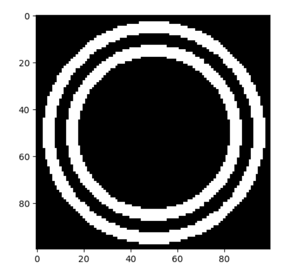
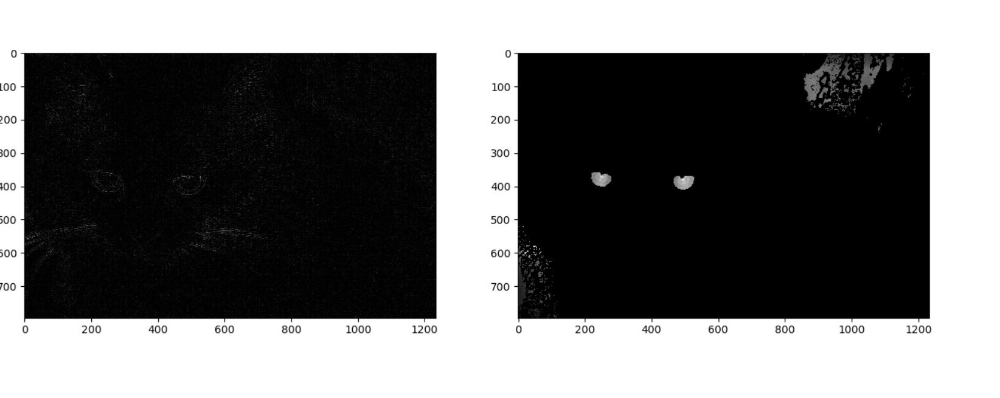
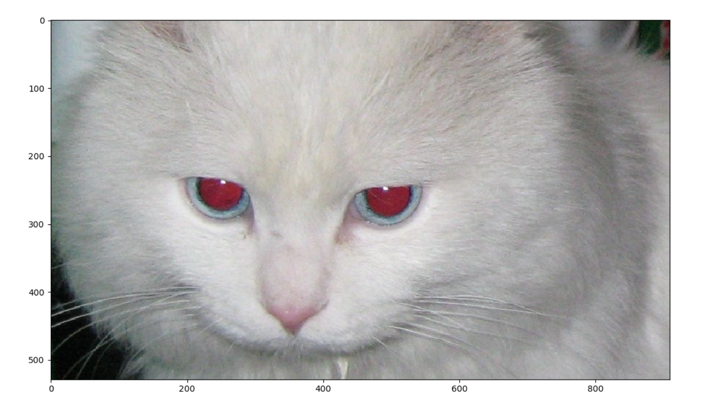
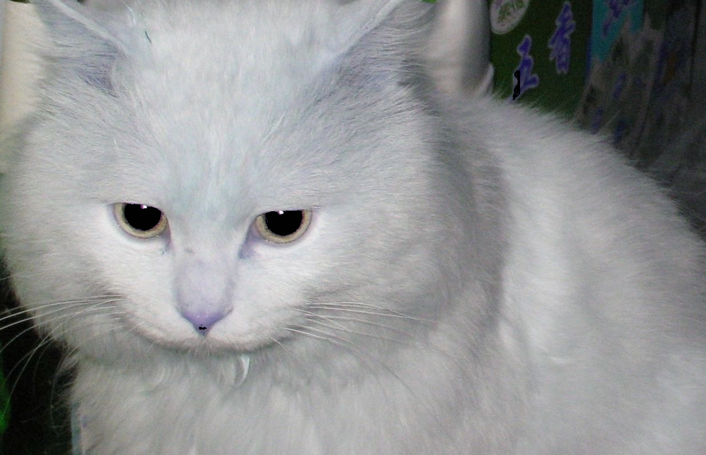

# 第四次小作业：去红眼

## 找出红眼所在区域

注意到猫的眼睛是较为规则的圆弧型，因此考虑直接使用卷积/相关的方法找出红眼。
\
首先构造一个滤波器，其构成为两个同心圆

将彩色图转化为灰度图，和滤波器进行二维相关运算（边缘用0填充以保持尺寸不变）

得到的效果并不好。进一步分析，发现猫毛大部分为白色，和滤波器卷积会得到比较高的值。但事实上我们只需要圆弧形的边缘。因此，对原图灰度图首先进行拉普拉斯变换后，再进行滤波

如上图，左图为灰度图拉普拉斯变换，右图为卷积滤波结果

滤波后的结果还包括一些其他区域，但其相对值较小。我们使用全图的一半作为阈值即可得到眼睛周边区域

## 去红眼

接下来，按照课件方法，将H为$-\frac{\pi}{4}$到$\frac{\pi}{4}$且S值大于0.3的像素的S值置为一个很低的值

得到结果(res.jpg)

