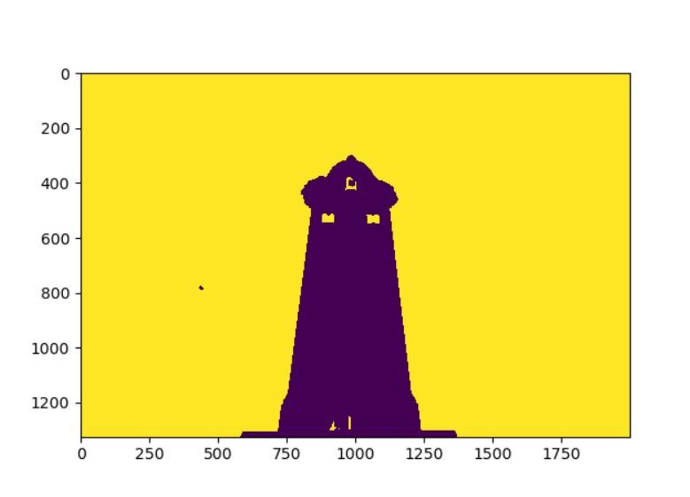
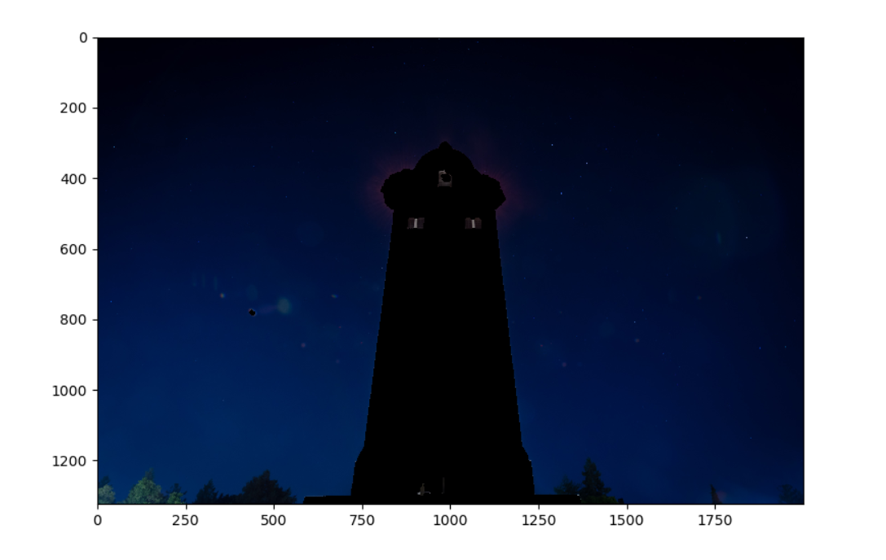
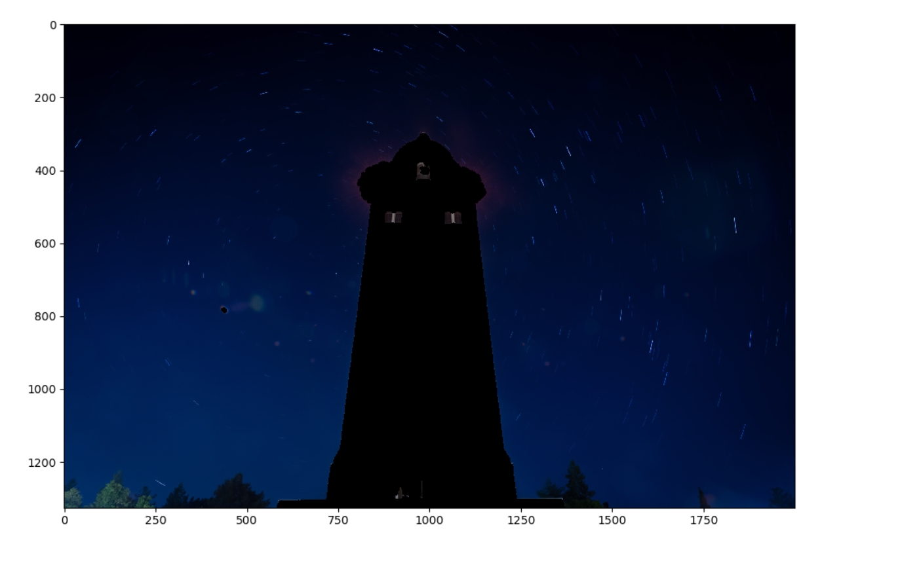
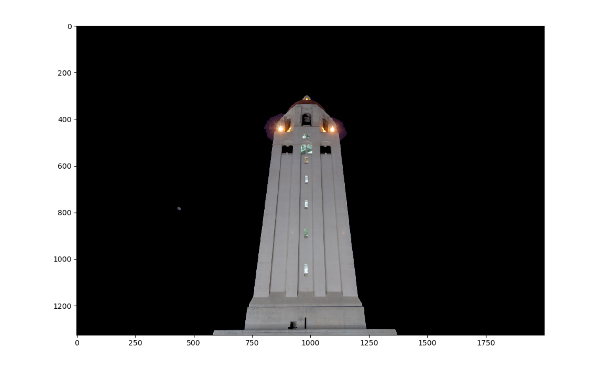
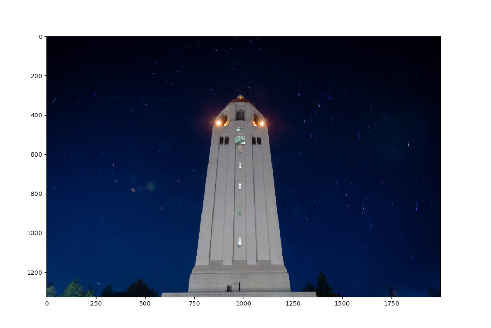

# 第三次大作业：星轨合成

## 星轨合成方法

经过调研，没有找到比较完整的资料。在Photoshop等图片处理软件中，一般使用“堆栈”的“最大值”功能合成星轨，即取各像素点的最大值。

## 我们的方法

我们的方法是基于图像二值化。虽然思路朴素，但最终效果不错。

第一步是分离出图像前景和背景。我们注意到星光的亮度比图像的近景部分（也就是分割背景）更弱一些，尤其是红色通道的亮度差异比较明显。因此，使用阈值法，提取图片中所有的星星和黑色的天空作为前景，其余部分为背景。这个过程中，较亮的飞机和卫星的光线也被去除了。

前景掩膜：

第二步是将前景逐像素取最大值。由于星轨是星光的轨迹，星光明显亮于天空背景，因此，将各时刻照片的前景逐像素取亮度最大值，就是最终的前景。

前景原图：

前景结果：

第三步，将前景和背景相加，得到结果。

背景原图：

阶段结果：

由于将全部照片同时运算所需内存较大，因此采取分阶段措施。将所有照片分为16张一组的多组，先对每组进行合成，再将各组结果合成为最终结果。

最终结果：

## 运行方法

    python trail-gen.py